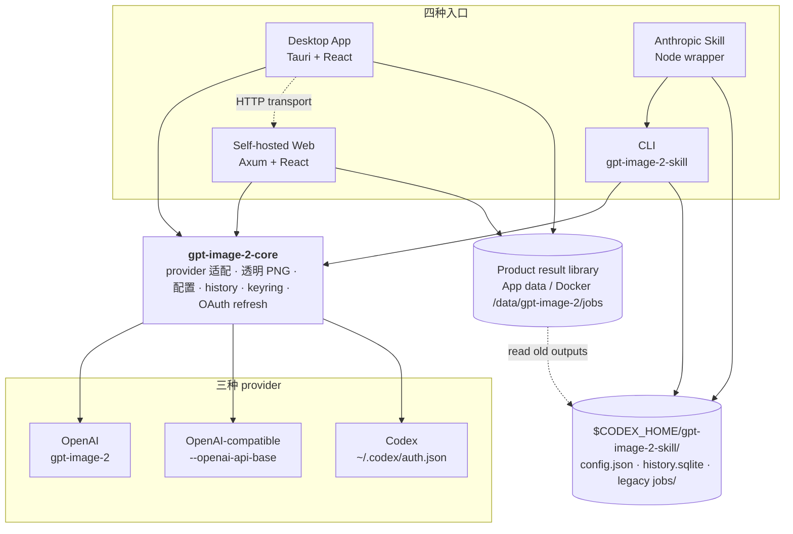
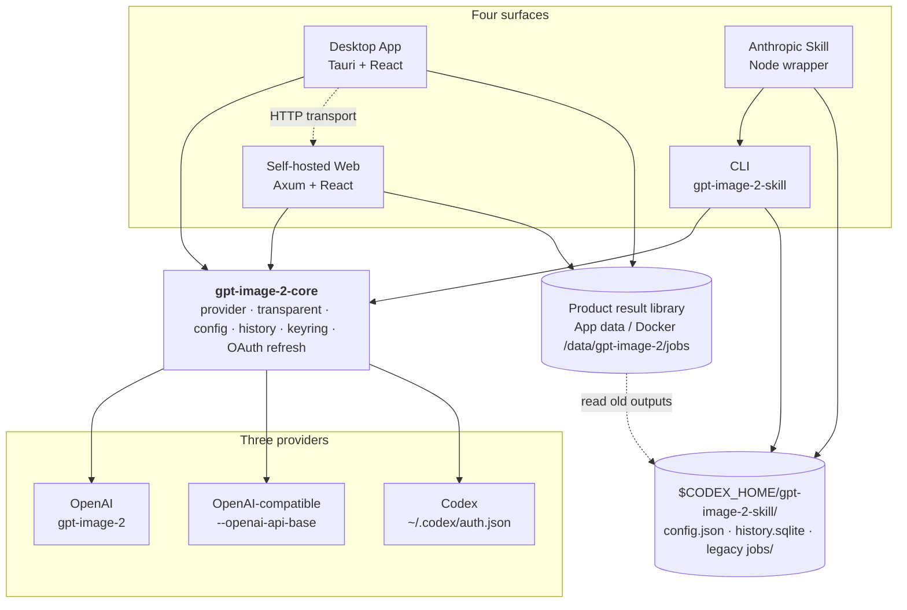

# gpt-image-2-skill

<p align="center">
  
</p>

[](https://github.com/Wangnov/gpt-image-2-skill/releases)
[](https://github.com/Wangnov/gpt-image-2-skill/actions/workflows/release-candidate.yml)
[](https://github.com/Wangnov/gpt-image-2-skill/blob/main/LICENSE)
[](https://www.rust-lang.org/)
[](https://www.npmjs.com/package/gpt-image-2-skill)
[](https://github.com/Wangnov/homebrew-tap)

**Language: 中文 | [English](#english)**

一个 Rust core 跑四种入口的 GPT Image 2 工具链。CLI、桌面 App、自托管 Docker Web、可安装 Skill 共用同一份 provider 适配层、透明 PNG 流水线、配置与本地历史,统一以 agent-first 的 JSON stdout + JSONL stderr 协议输出结果。

## 目录

- [架构](#架构)
- [项目定位](#项目定位)
- [快速开始](#快速开始)
- [运行时矩阵](#运行时矩阵)
- [Provider 矩阵](#provider-矩阵)
- [核心能力](#核心能力)
  - [图像生成与编辑](#图像生成与编辑)
  - [透明 PNG 流水线](#透明-png-流水线)
  - [Agent 协议](#agent-协议)
- [配置与密钥](#配置与密钥)
- [桌面 App](#桌面-app)
- [Docker Web 自托管](#docker-web-自托管)
- [Skill 集成](#skill-集成)
- [Cloudflare Worker relay](#cloudflare-worker-relay)
- [仓库结构](#仓库结构)
- [本地开发](#本地开发)
- [发布与分发](#发布与分发)
- [文档](#文档)
- [许可证](#许可证)

## 架构



`gpt-image-2-core` 是单一权威实现:provider 路由、`/images/generations` 与 `/images/edits` multipart、Codex `image_generation` SSE、`401` 触发的 OAuth refresh、retry、`config.json` 解析、Keychain/file/env 三源凭据解析、SQLite history、结果存储上传、本地透明 PNG chroma + dual-background 抠图与多 profile 验证全部住在 core 里。CLI 是其薄壳,Tauri sidecar 直接复用同版本二进制,Docker Web 把 core 包成 Axum HTTP 服务,Skill 通过 Node wrapper 调到 CLI。CLI/Skill 继续使用 `$CODEX_HOME/gpt-image-2-skill/`;桌面 App 和 Docker Web 的新生成结果进入产品结果库,旧 jobs 目录仅作为兼容读取来源。

## 项目定位

- **Agent-first 协议** — 每条命令都返回统一 JSON envelope (`ok` / `error.code` / `data`),进度事件以 JSONL 形式走 stderr,错误码可机读。包括 `request create` raw 转发出口,允许 agent 在协议没覆盖的场景下直接打 OpenAI 或 Codex 上游。
- **三 provider 同接口** — `OPENAI_API_KEY` / OpenAI-compatible base URL / Codex `auth.json` 走完全相同的命令面;切 provider 不改命令形状,只换 `--provider`,Codex `401` 自动 refresh 一次再重试。
- **透明 PNG 是终端交付** — `transparent generate` / `transparent extract` / `transparent verify` 把 controlled-matte 生成、本地 chroma 与 dual-background 抠图、9 种 profile 化质量门绑成完整流水线;不依赖 provider native `--background transparent`。
- **结果库 / 一码多端** — CLI/Skill 保持轻工具形态,输出路径由命令控制;桌面 App 和 Docker Web 管理自己的产品结果库,同时保留旧 `$CODEX_HOME/gpt-image-2-skill/jobs` 的兼容读取。服务端运行时还可以把生成结果异步上传到多个存储目标,再带着 `outputs[].uploads[]` 触发通知。

## 快速开始

挑跟你身份相符的一条路径开始,其余命令在下面的[核心能力](#核心能力)里就近展示。

### 我是 agent 调用方 — CLI + JSON

```bash
cargo install gpt-image-2-skill --locked
# 或 brew install wangnov/tap/gpt-image-2-skill
# 或 npm install --global gpt-image-2-skill

OPENAI_API_KEY=sk-... gpt-image-2-skill --json --json-events \
  images generate \
  --prompt "A studio product photo of a red apple on transparent background" \
  --out ./apple.png \
  --background transparent --format png --size 2K
```

`--json` 打印结构化结果到 stdout,`--json-events` 把进度事件以 JSONL 形式打到 stderr。两者独立,可单独使用。

### 我是桌面用户 — Homebrew Cask

```bash
brew install --cask wangnov/tap/gpt-image-2
```

或从 [GitHub Releases](https://github.com/Wangnov/gpt-image-2-skill/releases/latest) 下载对应平台安装包。macOS DMG 通过 Developer ID 签名并完成 Apple notarization,App 内置 Tauri 自动更新器。详见[桌面 App](#桌面-app)。

### 我是开发者要嵌入或自托管 — Skill / Docker Web

```bash
# 把 Skill 装到 Anthropic skills CLI / Claude Code
npx skills add https://github.com/Wangnov/gpt-image-2-skill --skill gpt-image-2-skill

# 或者起一个本地 Docker Web 服务
docker build -t gpt-image-2-web .
mkdir -p "$HOME/.local/share/gpt-image-2" \
  "$HOME/.local/share/gpt-image-2-codex/gpt-image-2-skill" \
  "$HOME/.codex/gpt-image-2-skill/jobs"
docker run --rm -p 8787:8787 \
  -v "$HOME/.local/share/gpt-image-2:/data/gpt-image-2" \
  -v "$HOME/.local/share/gpt-image-2-codex:/data/codex" \
  -v "$HOME/.codex/gpt-image-2-skill/jobs:/data/codex/gpt-image-2-skill/jobs:ro" \
  -v "$HOME/.codex/auth.json:/data/codex/auth.json:ro" \
  gpt-image-2-web
```

详见 [Skill 集成](#skill-集成) 和 [Docker Web 自托管](#docker-web-自托管)。

## 运行时矩阵

| 入口 | 安装命令 | 配置 / 数据位置 | 适用场景 |
|---|---|---|---|
| **CLI** (Rust binary) | `cargo install gpt-image-2-skill --locked`<br/>`brew install wangnov/tap/gpt-image-2-skill`<br/>`npm install -g gpt-image-2-skill`<br/>`cargo binstall gpt-image-2-skill` | `$CODEX_HOME/gpt-image-2-skill/` | agent 直调、CI、脚本编排 |
| **桌面 App** (Tauri) | `brew install --cask wangnov/tap/gpt-image-2`<br/>或 GitHub Releases DMG / NSIS / AppImage / deb / rpm | 配置/历史暂用 `$CODEX_HOME/gpt-image-2-skill/`;新结果默认进系统 App 数据目录;导出默认到 `~/Downloads/GPT Image 2` | 桌面用户;sidecar 调本地 CLI,可切换 HTTP 后端模式 |
| **Docker Web** (Axum) | `docker build -t gpt-image-2-web .` | 新结果默认 `/data/gpt-image-2/jobs`;旧 `/data/codex/gpt-image-2-skill/jobs` 可只读兼容 | 自托管、远程访问、内网共享 |
| **Skill** | `npx skills add https://github.com/Wangnov/gpt-image-2-skill --skill gpt-image-2-skill` | 复用调到的 CLI 的 `$CODEX_HOME` | Claude Code、Anthropic skills CLI |
| **Rust crate** | `gpt-image-2-core = "0.4"` | 调用方决定 | 嵌入第三方 Rust 工程,自定义 surface |

`$CODEX_HOME` 默认为 `~/.codex/`,可由环境变量覆盖。CLI/Skill 继续按命令参数输出;桌面 App 和 Docker Web 把“结果库”和“导出文件夹”分开,避免把内部 jobs 目录误当作用户下载目录。

## 结果存储与第三方集成

桌面 App(Tauri sidecar)和 Docker Web 会在生图成功后先写入产品结果库,再异步上传结果文件,最后派发通知/webhook。上传状态写入 `history.sqlite`,任务历史会返回 `storage_status` 以及每个输出的 `uploads[]` 记录,第三方服务可以在 webhook 收到 `job.outputs[].uploads[]` 后按配置的公开 URL 或存储侧 key 获取图片。静态 Web 只保存当前浏览器数据,不会保存远端存储密钥,也不会执行服务端上传。

支持的目标类型:

| 类型 | 用途 | 关键配置 |
|---|---|---|
| `local` | 本地目录与默认 fallback | `directory`,可选 `public_base_url` |
| `s3` | AWS S3 / S3-compatible PUT | `bucket`,`region`,`endpoint`,`prefix`,`access_key_id`,`secret_access_key`,`session_token`,`public_base_url` |
| `webdav` | WebDAV PUT,自动 MKCOL 父目录 | `url`,`username`,`password`,`public_base_url` |
| `http` | 自定义 HTTP multipart 上传 | `url`,`method`,`headers`,`public_url_json_pointer` |
| `sftp` | SFTP 上传 | `host`,`port`,`host_key_sha256`,`username`,`password` 或 `private_key`,`remote_dir`,`public_base_url` |

全局配置支持多个目标、多个默认上传目标、多个 fallback 目标、fallback 策略(`never` / `on_failure` / `always`)以及输出级/目标级并发。任务请求也可以独立传 `storage_targets` 和 `fallback_targets` 覆盖默认目标。远端 HTTP/S3/WebDAV 上传默认拒绝 loopback/private/link-local 等非公网地址并禁用重定向;SFTP 必须配置服务器 SHA256 host key 指纹。

## Provider 矩阵

| Provider | 默认模型 | 端点 | 凭据来源 | 支持 edit | 支持 mask | 备注 |
|---|---|---|---|---|---|---|
| `openai` | `gpt-image-2` | `https://api.openai.com/v1` | `OPENAI_API_KEY` env / `--api-key` | ✓ | ✓ | OpenAI-only flags: `--n` / `--moderation` / `--mask` / `--input-fidelity` |
| `openai`(自定义 base) | `gpt-image-2`(可改) | `--openai-api-base https://...` 或 config | 同上 | ✓ | ✓ | OpenAI-compatible,需要实现 `/images/generations` 与 `/images/edits` |
| `codex` | `gpt-5.4` | `https://chatgpt.com/backend-api/codex/responses` | `~/.codex/auth.json` 或 `$CODEX_HOME/auth.json` | ✗ | ✗ | 通过 `image_generation` 工具委派给 `gpt-image-2`;`401` 自动 OAuth refresh 一次再重试 |
| 命名 provider | 由配置决定 | 由配置决定 | 由配置决定(file / env / keychain) | 视类型 | 视类型 | 在 `config.json` 中以任意名称注册 `openai-compatible` 或 `codex` 类型 |

选择策略 (`--provider <value>`):

- `openai` / `codex` — 强制走对应 provider。
- `auto`(默认)— 优先用配置中的 `default_provider`,否则按 OpenAI → Codex 自动 fallback。
- `<name>` — 解析配置中已注册的命名 provider。

实际命中的 provider 会在 `doctor` 输出的 `provider_selection.resolved` 里报告。

## 核心能力

### 图像生成与编辑

```bash
# 用 OpenAI-compatible base
OPENAI_API_KEY=sk-... gpt-image-2-skill --json \
  --provider openai --openai-api-base https://api.duckcoding.ai/v1 \
  images generate \
  --prompt "A polished geometric app logo on transparent background" \
  --out ./logo.png --background transparent --format png --size 2K

# 用 Codex auth.json
gpt-image-2-skill --json --json-events \
  --provider codex \
  images generate \
  --prompt "A glossy red apple sticker on transparent background" \
  --out ./apple.png

# 参考图编辑(OpenAI multipart)
gpt-image-2-skill --json --json-events \
  images edit \
  --prompt "Refine this logo, keep transparency, and improve visibility on dark backgrounds" \
  --ref-image ./logo.png \
  --out ./logo-edit.png \
  --background transparent --format png --size 1024x1024
```

支持的输入 / 输出参数:

- `--format png|jpeg|webp`,`--quality high|medium|low|auto`,`--compression`,`--input-fidelity`(OpenAI only)
- `--ref-image` 最多 16 张,`--mask`(OpenAI only)
- `--size`:`2K` → `2048x2048`,`4K` → `3840x2160`,`4K` 竖版 → `2160x3840`,方图高分辨率上限 `2880x2880`,自定义 `WIDTHxHEIGHT` 须满足:边都是 16 的倍数、最大边长 `3840`、最大总像素 `8294400`、最大长宽比 `3:1`
- 默认 retry 3 次,Codex `401` 自动 refresh 一次后重试;`--retries`、`--retry-delay-seconds`、`--request-timeout-seconds` 可调

### 透明 PNG 流水线

不依赖 provider native `--background transparent`(Codex 尤其不可靠)。流水线分三步:**生成 controlled matte 源图 → 本地抠图 → profile 化质量门验证**。

```bash
# 端到端:从 prompt 生成最终透明 PNG(默认 chroma)
gpt-image-2-skill --json --json-events \
  --provider codex \
  transparent generate \
  --prompt "A glossy red apple sticker, centered, no text, no frame" \
  --out ./apple-transparent.png --size 2K --quality high

# Chroma:已知颜色单背景源图,自动采样 matte
gpt-image-2-skill --json \
  transparent extract --method chroma \
  --input ./source-magenta.png --matte-color auto \
  --out ./asset.png --strict

# Dual-background:玻璃 / 流光 / 烟雾等半透明素材
gpt-image-2-skill --json \
  transparent extract --method dual \
  --dark-image ./glow-black.png --light-image ./glow-white.png \
  --out ./glow-transparent.png --profile glow --strict

# 交付前的最终质量门
gpt-image-2-skill --json \
  transparent verify \
  --input ./apple-transparent.png \
  --expected-matte-color '#00ff00' \
  --profile product --strict
```

**Profile**(`--profile`,验证用)— 决定质量门严格度:

| Profile | 适用 | 额外严格项 |
|---|---|---|
| `generic` | 未知或不规则素材 | PNG alpha、真实透明区、棋盘格拒绝 |
| `icon` | 干净的单主体 icon、道具 | 干净不透明核心、足够边距、低杂散像素 |
| `product` | 产品 / 物体抠图 | 干净不透明核心、足够边距、低残留 |
| `sticker` | 贴纸、徽章、多组件道具 | 比 `icon` 更宽容多组件 |
| `seal` | 印章、徽章、含内嵌符号的 logo | 允许圆环 + 中心符号这类分裂组件 |
| `translucent` | 玻璃、液体、晶体 | 要求 partial alpha;alpha max 不必 255 |
| `glow` | 光带、火焰、烟雾、粒子 | 要求 partial alpha 与透明边距 |
| `shadow` | 软阴影 | 要求 partial alpha 与透明边距 |
| `effect` | 硬 alpha 粒子、爆发、UI 特效 | 要求透明边距,但不强制 partial alpha |

**Material preset**(`--material`,chroma extract 用)— 调 chroma `threshold` / `softness` / `spill_suppression`:`standard` / `soft-3d` / `flat-icon` / `sticker` / `glow`,手动 flag 可继续覆盖。

**Verify 输出关键字段**:`passed`、`alpha_min/alpha_max`、`transparent_ratio`、`partial_pixels`、`checkerboard_detected`、`touches_edge`、`stray_pixel_count`、`matte_residue_score`、`halo_score`、`transparent_rgb_scrubbed`、`alpha_health_score`、`residue_score`、`quality_score`、`failure_reasons`、`warnings`。完整字段表见 [`skills/gpt-image-2-skill/references/transparent-png.md`](skills/gpt-image-2-skill/references/transparent-png.md)。

### Agent 协议

**统一 JSON envelope** — 每条命令成功返回结构化结果,失败返回:

```json
{
  "ok": false,
  "error": {
    "code": "transparent_verification_failed",
    "message": "...",
    "detail": { "...": "optional" }
  }
}
```

主要错误码:`runtime_unavailable` / `invalid_command` / `invalid_argument` / `unsupported_option` / `auth_missing` / `auth_parse_failed` / `refresh_failed` / `network_error` / `http_error` / `invalid_body_json` / `transparent_verification_failed` / `transparent_input_mismatch`。

**JSONL 进度事件**(`--json-events`,stderr)— `multipart_prepared`、`retry_started`、Codex SSE 增量等,详见 [`skills/gpt-image-2-skill/references/json-events.md`](skills/gpt-image-2-skill/references/json-events.md)。

**控制台命令**:

```bash
# 环境健康检查 — provider 选择、retry policy、运行时版本
gpt-image-2-skill --json doctor

# 检查所有 provider 的凭据可用性
gpt-image-2-skill --json auth inspect

# 浏览本地历史(SQLite),支持搜索、分页
gpt-image-2-skill --json history list --limit 20
gpt-image-2-skill --json history search --query "apple"

# 共享配置管理
gpt-image-2-skill --json config inspect
gpt-image-2-skill --json config add-provider \
  --name my-image-api --type openai-compatible \
  --api-base https://example.com/v1 --api-key sk-... --set-default

# 凭据存储到 macOS Keychain / Linux Secret Service / Windows Credential Manager
gpt-image-2-skill --json secret set --provider my-image-api --field api_key

# Raw escape hatch — 直接打 OpenAI / Codex 上游
gpt-image-2-skill --json \
  request create --request-operation generate \
  --body-file ./body.json --out-image ./out.png --expect-image
```

完整 envelope 字段表见 [`skills/gpt-image-2-skill/references/json-output.md`](skills/gpt-image-2-skill/references/json-output.md)。

## 配置与密钥

共享配置文件路径:

| 文件 | 路径 |
|---|---|
| 配置 | `$CODEX_HOME/gpt-image-2-skill/config.json` |
| 历史 | `$CODEX_HOME/gpt-image-2-skill/history.sqlite` |
| CLI/Skill 任务产物 | `$CODEX_HOME/gpt-image-2-skill/jobs/` |
| 桌面 App 结果库 | 系统 App 数据目录下的 `com.wangnov.gpt-image-2/jobs` |
| Docker Web 结果库 | `/data/gpt-image-2/jobs` |
| 默认导出文件夹 | 桌面 App 默认 `~/Downloads/GPT Image 2` |

`$CODEX_HOME` 默认 `~/.codex/`。CLI/Skill 继续使用这套轻工具目录;桌面 App 和 Docker Web 的新结果进入产品结果库,旧 jobs 路径保留为兼容读取。

`config.json` 示例:

```json
{
  "version": 1,
  "default_provider": "my-image-api",
  "providers": {
    "my-image-api": {
      "type": "openai-compatible",
      "api_base": "https://example.com/v1",
      "model": "gpt-image-2",
      "credentials": {
        "api_key": { "source": "file", "value": "sk-..." }
      }
    }
  }
}
```

**凭据三层来源**(`credentials.<field>.source`):

| Source | 形态 | 用途 |
|---|---|---|
| `file` | `{ "source": "file", "value": "sk-..." }` | 直接落 `config.json`(注意权限) |
| `env` | `{ "source": "env", "env": "MY_API_KEY" }` | 从环境变量读取 |
| `keychain` | `{ "source": "keychain", "service": "gpt-image-2-skill", "account": "providers/<name>/api_key" }` | macOS Keychain / Linux Secret Service / Windows Credential Manager |

`secret set` / `secret get` / `secret delete` 命令用来管理 keychain 项。OpenAI 与 Codex 默认凭据(`OPENAI_API_KEY` env、`~/.codex/auth.json`)无需注册到 config 即可使用。

## 桌面 App

源码位于 [`apps/gpt-image-2-app`](apps/gpt-image-2-app),基于 Tauri + React,通过 sidecar 调用同版本 CLI 二进制。

**安装**:

```bash
brew install --cask wangnov/tap/gpt-image-2
```

或从 [GitHub Releases](https://github.com/Wangnov/gpt-image-2-skill/releases/latest) 下载:

- macOS Apple Silicon:`GPT.Image.2_*_aarch64.dmg`
- macOS Intel:`GPT.Image.2_*_x64.dmg`
- Windows:`GPT.Image.2_*_x64-setup.exe`
- Linux:`GPT.Image.2_*_amd64.AppImage` / `*.deb` / `*.rpm`

macOS DMG 通过 Developer ID 签名并完成 Apple notarization。App 内置 Tauri updater,正式版发布后会启动时轻量提示新版本,「设置 → 关于」可手动检查。详见 [`docs/tauri-release.md`](docs/tauri-release.md)。

**HTTP 后端模式** — 桌面 App 默认走 Tauri sidecar 调本地 CLI,但 `npm run build:http` 可以构建一份直连 `/api` 的版本,被 Docker Web 复用。这同时也是本仓库前端开发的推荐模式:

```bash
just dev-http-backend     # 起本地 Docker 后端:新结果写入 ~/.local/share/gpt-image-2,旧 ~/.codex jobs 只读
just dev-http-frontend    # 起 Vite dev server,API 走 :8787
```

## Docker Web 自托管

`gpt-image-2-web`(`crates/gpt-image-2-web`,基于 Axum + tower-http)把 core 包成 HTTP 服务,前端是同一份 React UI,通过 `/api` 调到后端。Docker Web 的新生成结果默认写入 `/data/gpt-image-2/jobs`;旧 `$CODEX_HOME/gpt-image-2-skill/jobs` 可作为只读兼容目录,避免把产品结果库继续和 CLI/Skill jobs 混在一起。

**构建与运行**:

```bash
docker build -t gpt-image-2-web .

# 直接用 OPENAI_API_KEY
docker run --rm -p 8787:8787 \
  -v gpt-image-2-data:/data \
  -e OPENAI_API_KEY=sk-... \
  gpt-image-2-web

# Docker Web 可写配置/历史，本机旧 jobs 只读兼容(开发推荐)
mkdir -p "$HOME/.local/share/gpt-image-2" \
  "$HOME/.local/share/gpt-image-2-codex/gpt-image-2-skill" \
  "$HOME/.codex/gpt-image-2-skill/jobs"
docker run --rm -p 8787:8787 \
  -v "$HOME/.local/share/gpt-image-2:/data/gpt-image-2" \
  -v "$HOME/.local/share/gpt-image-2-codex:/data/codex" \
  -v "$HOME/.codex/gpt-image-2-skill/jobs:/data/codex/gpt-image-2-skill/jobs:ro" \
  -v "$HOME/.codex/auth.json:/data/codex/auth.json:ro" \
  gpt-image-2-web
```

打开 [http://localhost:8787](http://localhost:8787)。完整说明见 [`docs/docker-web.md`](docs/docker-web.md)。

## Skill 集成

源码位于 [`skills/gpt-image-2-skill`](skills/gpt-image-2-skill)。入口是 [`scripts/gpt_image_2_skill.cjs`](skills/gpt-image-2-skill/scripts/gpt_image_2_skill.cjs),它本身不执行图像逻辑,而是按下面的顺序解析底层 Rust 二进制并转发参数。

**安装**:

```bash
# Anthropic skills CLI / Codex
npx skills add https://github.com/Wangnov/gpt-image-2-skill --skill gpt-image-2-skill

# Claude Code(直接复制到本地 skills 目录)
git clone https://github.com/Wangnov/gpt-image-2-skill /tmp/gpt-image-2-skill
cp -r /tmp/gpt-image-2-skill/skills/gpt-image-2-skill ~/.claude/skills/
```

**Wrapper 解析顺序**:

1. `GPT_IMAGE_2_SKILL_BIN` 环境变量(指向具体二进制)
2. `PATH` 上的 `gpt-image-2-skill`(cargo / brew / npm 安装)
3. Tauri App bundled CLI(`GPT_IMAGE_2_SKILL_APP_BIN` 或标准 app bundle 路径)
4. 仓库内 `cargo run -q -p gpt-image-2-skill --`(仅当 `Cargo.toml` 与 `cargo` 都存在)
5. `${XDG_CACHE_HOME:-~/.cache}/gpt-image-2-skill/<version>/<target>/` 缓存
6. Bootstrap:下载对应版本的 GitHub Release 资产并缓存

设 `GPT_IMAGE_2_SKILL_SKIP_BOOTSTRAP=1` 关闭最后一步下载。

**Skill evals** — `skills/gpt-image-2-skill/evals/` 里有两套评估:

- `trigger-eval.json` — 20 条用户语料(10 应触发 / 10 临近不应触发),通过 `skill-creator` 优化循环度量 description 触发准确率。
- `evals.json` — 5 条 prompt-level 任务(`doctor-smoke`、`generate-transparent-png` 等),验证 envelope 形态与 retry 策略常量。

详见 [`skills/gpt-image-2-skill/SKILL.md`](skills/gpt-image-2-skill/SKILL.md) 与 [`skills/gpt-image-2-skill/evals/README.md`](skills/gpt-image-2-skill/evals/README.md)。

## Cloudflare Worker relay

[`workers/gpt-image-2-relay`](workers/gpt-image-2-relay) 是一个可选的浏览器 transport 中继,部署在 `image.codex-pool.com/api/relay*`。它让纯浏览器构建的 Web UI 在不暴露 API key 的前提下,把请求经由 Worker 转发给 OpenAI / OpenAI-compatible 上游。

主要能力:

- `RELAY_MODE`:`open`(任意上游 URL,凭 `x-gpt-image-2-upstream` header 指定)或 `allowlist`(只允许配置中列出的 origin)
- `RELAY_ALLOWED_ORIGINS` / `RELAY_ALLOWED_METHODS` / `RELAY_MAX_REQUEST_BYTES` / `RELAY_MAX_RESPONSE_BYTES` 全部可调
- 请求 / 响应 header 黑名单清理(剥离 `cookie`、`set-cookie`、`cf-*` 等)
- `report-only` 模式可在不阻断流量的情况下采集 allowlist 命中率

```bash
just relay-test    # 跑 vitest + tsc
just relay-dry     # wrangler dry-run
just relay-deploy  # 部署到生产路由
```

如果只用 CLI / 桌面 App / Docker Web,这一段可以忽略。它存在的意义是让浏览器侧 transport 不必把 API key 嵌进前端 bundle。

## 仓库结构

```
gpt-image-2-skill/
├── crates/
│   ├── gpt-image-2-core/      Rust core:provider · transparent · config · history · keyring · OAuth refresh
│   ├── gpt-image-2-skill/     CLI binary(薄壳,主入口在 core)
│   └── gpt-image-2-web/       Axum + tower-http 自托管 HTTP 后端
├── apps/
│   └── gpt-image-2-app/       Tauri 桌面 App + React UI(双 transport:Tauri sidecar / HTTP)
├── workers/
│   └── gpt-image-2-relay/     Cloudflare Worker 浏览器 transport 中继
├── skills/
│   └── gpt-image-2-skill/     可安装 Skill:SKILL.md / agents / references / evals / Node wrapper
├── packages/npm/              npm 根包 + 平台子包矩阵
├── scripts/release/           release 准备 / 发布 / 验证脚本
├── docs/                      docker-web · tauri-release 等专题文档
├── Cargo.toml                 workspace 清单
├── Dockerfile                 Docker Web 镜像
└── justfile                   本地任务入口
```

## 本地开发

通过 `just --list` 查看所有任务。常用命令:

```bash
just install-local         # 从工作区安装 CLI
just test                  # cargo test -p gpt-image-2-skill
just sync-skill            # 同步可安装 Skill bundle
just smoke-skill-install   # Skill 安装冒烟

just app-typecheck         # Tauri / Web 前端类型检查
just app-build             # Tauri 前端打包
just app-build-http        # HTTP 模式前端打包(给 Docker Web 用)
just app-test-browser      # 浏览器 transport vitest
just dev-tauri             # 起 Tauri 开发服务器(仅在需要验证桌面专属能力时用)
just dev-http-backend      # 起本地 Docker 后端,配置/历史可写,旧 jobs 只读
just dev-http-frontend     # 起 Vite dev server,API 走 :8787

just relay-test            # Cloudflare Worker vitest + tsc
just relay-dry             # wrangler dry-run
just relay-deploy          # 部署到 image.codex-pool.com/api/relay*

just release-prepare       # 本地 release 准备闸
just release-verify        # 本地 release 验证闸
just release-dry patch     # cargo release dry-run(默认 patch,可传 minor/major)
just release patch         # 真正的 release
just release-tauri v0.4.0  # 在已有 tag 上跑 Tauri App Release workflow
```

调试桌面 App 视觉与交互优先用 HTTP 后端模式(`just dev-http-backend` + `just dev-http-frontend`),它跟 Tauri sidecar 模式走相同 React UI,但调试更快;只有验证 Tauri 专属能力时才需要 `just dev-tauri`。

## 发布与分发

四个串联的 GitHub Actions workflow:

1. **Release** — cargo-dist 构建 CLI 资产、shell installer、PowerShell installer、Windows MSI,推 Homebrew formula。
2. **Publish npm Packages** — 从同一 GitHub Release 下载 CLI 资产,发布 npm 根包 + 平台子包,验证 cargo-binstall / npm / Homebrew formula 可达。
3. **Tauri App Release** — 同 tag 构建并上传 macOS DMG / Windows NSIS / Linux AppImage·deb·rpm,以及 Tauri updater 签名资产 + `latest.json`。macOS 走 Developer ID 签名 + notarization + stapler 验证;正式版同步更新桌面 cask 并标 `auto_updates true`。
4. **Post Release Verify** — 默认验 CLI 分发面;桌面 App 发布完成后会以 `verify_desktop_cask=true` 补验 Homebrew cask 安装路径。

分发面汇总:

| 通道 | 安装命令 |
|---|---|
| crates.io | `cargo install gpt-image-2-skill --locked` |
| cargo-binstall | `cargo binstall gpt-image-2-skill --no-confirm` |
| Homebrew formula | `brew install wangnov/tap/gpt-image-2-skill` |
| Homebrew cask | `brew install --cask wangnov/tap/gpt-image-2` |
| npm | `npm install --global gpt-image-2-skill` |
| Skill | `npx skills add https://github.com/Wangnov/gpt-image-2-skill --skill gpt-image-2-skill` |
| GitHub Releases | DMG / NSIS / AppImage / deb / rpm / shell+PS installer / MSI / CLI tarball |

npm 首发使用 `NPM_TOKEN`(GitHub Actions secret)+ `--provenance`。包上线后可执行 `scripts/release/configure-npm-trust.sh` 绑定 trusted publisher,脚本幂等。手动验收可走 `npm-publish.yml` 的 `dry_run` 输入跑通整条 npm 打包链路。

## 文档

- Skill 说明:[`skills/gpt-image-2-skill/SKILL.md`](skills/gpt-image-2-skill/SKILL.md)
- Skill references:[`skills/gpt-image-2-skill/references/`](skills/gpt-image-2-skill/references)(`json-output` / `json-events` / `providers` / `transparent-png` / `sizes-and-formats` / `troubleshooting`)
- Skill evals:[`skills/gpt-image-2-skill/evals/README.md`](skills/gpt-image-2-skill/evals/README.md)
- Docker Web:[`docs/docker-web.md`](docs/docker-web.md)
- Tauri 桌面发布:[`docs/tauri-release.md`](docs/tauri-release.md)
- Release 流程脚本:[`scripts/release/prepare.sh`](scripts/release/prepare.sh) · [`scripts/release/publish.sh`](scripts/release/publish.sh) · [`scripts/release/verify.sh`](scripts/release/verify.sh)
- 本地任务入口:[`justfile`](justfile)

## 许可证

MIT。详见 [`LICENSE`](LICENSE)。

---

<a id="english"></a>

**Language: [中文](#gpt-image-2-skill) | English**

A GPT Image 2 toolchain where one Rust core powers four surfaces. The CLI, desktop app, self-hosted Docker Web, and installable Skill share the same provider adapter, transparent-PNG pipeline, configuration, and local history, all exposed through an agent-first JSON-on-stdout / JSONL-on-stderr protocol.

## Table of contents

- [Architecture](#architecture)
- [Why this project](#why-this-project)
- [Quickstart](#quickstart)
- [Surface matrix](#surface-matrix)
- [Provider matrix](#provider-matrix)
- [Capabilities](#capabilities)
  - [Image generation and edit](#image-generation-and-edit)
  - [Transparent PNG pipeline](#transparent-png-pipeline)
  - [Agent protocol](#agent-protocol)
- [Configuration and secrets](#configuration-and-secrets)
- [Desktop app](#desktop-app)
- [Self-hosted Docker Web](#self-hosted-docker-web)
- [Skill integration](#skill-integration)
- [Cloudflare Worker relay](#cloudflare-worker-relay-en)
- [Repository layout](#repository-layout)
- [Local development](#local-development)
- [Release and distribution](#release-and-distribution)
- [Docs](#docs)
- [License](#license)

## Architecture



`gpt-image-2-core` is the single source of truth: provider routing, `/images/generations` and `/images/edits` multipart, Codex `image_generation` SSE, OAuth refresh on `401`, retries, `config.json` parsing, three-source (Keychain / file / env) credential resolution, SQLite history, result-storage uploads, and the local transparent-PNG chroma + dual-background extraction with multi-profile verification all live in core. The CLI is a thin shell, the Tauri sidecar reuses the matching binary, the Docker Web wraps core in an Axum HTTP service, and the Skill calls the CLI through a Node wrapper. CLI/Skill keep using `$CODEX_HOME/gpt-image-2-skill/`; the desktop app and Docker Web write new outputs into a product result library while keeping old jobs readable for compatibility.

## Why this project

- **Agent-first protocol** — every command returns a uniform JSON envelope (`ok` / `error.code` / `data`). Progress events stream as JSONL on stderr. Error codes are machine-readable. A `request create` raw escape hatch lets agents hit OpenAI or Codex upstream directly when the protocol does not cover a use case.
- **Three providers, one surface** — `OPENAI_API_KEY`, an OpenAI-compatible base URL, and Codex `auth.json` go through identical command shapes; switching providers means changing `--provider`, not the command. Codex `401` triggers exactly one OAuth refresh and a single retry.
- **Transparent PNG as a deliverable** — `transparent generate` / `transparent extract` / `transparent verify` bundle controlled-matte generation, local chroma and dual-background extraction, and nine profile-based quality gates into a complete pipeline. It does not depend on provider-native `--background transparent`.
- **Result library, one codebase, many surfaces** — CLI/Skill stay lightweight and command-directed; the desktop app and Docker Web manage a product result library and can still read legacy `$CODEX_HOME/gpt-image-2-skill/jobs` outputs. Server-side runtimes can also upload generated outputs to multiple storage targets and then notify integrations with `outputs[].uploads[]`.

## Quickstart

Pick the path that matches who you are; other examples live in [Capabilities](#capabilities).

### I am calling this from an agent — CLI + JSON

```bash
cargo install gpt-image-2-skill --locked
# or brew install wangnov/tap/gpt-image-2-skill
# or npm install --global gpt-image-2-skill

OPENAI_API_KEY=sk-... gpt-image-2-skill --json --json-events \
  images generate \
  --prompt "A studio product photo of a red apple on transparent background" \
  --out ./apple.png \
  --background transparent --format png --size 2K
```

`--json` writes a structured result to stdout; `--json-events` streams JSONL progress on stderr. They are independent and can be used separately.

### I am a desktop user — Homebrew Cask

```bash
brew install --cask wangnov/tap/gpt-image-2
```

Or download the right installer from [GitHub Releases](https://github.com/Wangnov/gpt-image-2-skill/releases/latest). macOS DMGs are signed with Developer ID and notarized. The app ships with the Tauri updater. See [Desktop app](#desktop-app).

### I am embedding or self-hosting — Skill / Docker Web

```bash
# Install the Skill into Anthropic skills CLI / Claude Code
npx skills add https://github.com/Wangnov/gpt-image-2-skill --skill gpt-image-2-skill

# Or run a local Docker Web service
docker build -t gpt-image-2-web .
mkdir -p "$HOME/.local/share/gpt-image-2" \
  "$HOME/.local/share/gpt-image-2-codex/gpt-image-2-skill" \
  "$HOME/.codex/gpt-image-2-skill/jobs"
docker run --rm -p 8787:8787 \
  -v "$HOME/.local/share/gpt-image-2:/data/gpt-image-2" \
  -v "$HOME/.local/share/gpt-image-2-codex:/data/codex" \
  -v "$HOME/.codex/gpt-image-2-skill/jobs:/data/codex/gpt-image-2-skill/jobs:ro" \
  -v "$HOME/.codex/auth.json:/data/codex/auth.json:ro" \
  gpt-image-2-web
```

See [Skill integration](#skill-integration) and [Self-hosted Docker Web](#self-hosted-docker-web).

## Surface matrix

| Surface | Install | Config / data location | Use case |
|---|---|---|---|
| **CLI** (Rust binary) | `cargo install gpt-image-2-skill --locked`<br/>`brew install wangnov/tap/gpt-image-2-skill`<br/>`npm install -g gpt-image-2-skill`<br/>`cargo binstall gpt-image-2-skill` | `$CODEX_HOME/gpt-image-2-skill/` | Agent calls, CI, scripted pipelines |
| **Desktop app** (Tauri) | `brew install --cask wangnov/tap/gpt-image-2`<br/>or GitHub Releases DMG / NSIS / AppImage / deb / rpm | Config/history currently use `$CODEX_HOME/gpt-image-2-skill/`; new results default to the system app data directory; exports default to `~/Downloads/GPT Image 2` | Desktop users; sidecar invokes the local CLI, switchable to HTTP backend mode |
| **Docker Web** (Axum) | `docker build -t gpt-image-2-web .` | New results default to `/data/gpt-image-2/jobs`; old `/data/codex/gpt-image-2-skill/jobs` can be mounted read-only for compatibility | Self-hosted, remote access, intranet sharing |
| **Skill** | `npx skills add https://github.com/Wangnov/gpt-image-2-skill --skill gpt-image-2-skill` | Reuses the resolved CLI's `$CODEX_HOME` | Claude Code, Anthropic skills CLI |
| **Rust crate** | `gpt-image-2-core = "0.4"` | Caller chooses | Embed into another Rust project, build a custom surface |

`$CODEX_HOME` defaults to `~/.codex/` and can be overridden via the environment variable. CLI/Skill keep command-directed output behavior; the desktop app and Docker Web separate the internal result library from the user-facing export/download folder.

## Result Storage And Integrations

The desktop app(Tauri sidecar)and Docker Web first write completed images into the product result library, then upload result files asynchronously, then dispatch notifications/webhooks. Upload state is stored in `history.sqlite`; history and webhook payloads include job-level `storage_status` and per-output `uploads[]`, so third-party services can fetch images through the configured public URL or storage-side key. Static Web only stores results in the current browser data and does not persist remote storage secrets or run server-side uploads.

Supported target types:

| Type | Use case | Key config |
|---|---|---|
| `local` | Local directory and default fallback | `directory`, optional `public_base_url` |
| `s3` | AWS S3 / S3-compatible PUT | `bucket`, `region`, `endpoint`, `prefix`, `access_key_id`, `secret_access_key`, `session_token`, `public_base_url` |
| `webdav` | WebDAV PUT with parent MKCOL | `url`, `username`, `password`, `public_base_url` |
| `http` | Custom multipart HTTP upload | `url`, `method`, `headers`, `public_url_json_pointer` |
| `sftp` | SFTP upload | `host`, `port`, `host_key_sha256`, `username`, `password` or `private_key`, `remote_dir`, `public_base_url` |

Global config can define many targets, multiple default upload targets, multiple fallback targets, fallback policy(`never` / `on_failure` / `always`), and output/target concurrency. Individual generation/edit requests can override target selection with `storage_targets` and `fallback_targets`. Remote HTTP/S3/WebDAV uploads reject loopback/private/link-local addresses by default and do not follow redirects; SFTP requires a pinned SHA256 server host-key fingerprint.

## Provider matrix

| Provider | Default model | Endpoint | Credentials | Edit | Mask | Notes |
|---|---|---|---|---|---|---|
| `openai` | `gpt-image-2` | `https://api.openai.com/v1` | `OPENAI_API_KEY` env / `--api-key` | ✓ | ✓ | OpenAI-only flags: `--n` / `--moderation` / `--mask` / `--input-fidelity` |
| `openai` (custom base) | `gpt-image-2` (overridable) | `--openai-api-base https://...` or config | Same as above | ✓ | ✓ | OpenAI-compatible; must implement `/images/generations` and `/images/edits` |
| `codex` | `gpt-5.4` | `https://chatgpt.com/backend-api/codex/responses` | `~/.codex/auth.json` or `$CODEX_HOME/auth.json` | ✗ | ✗ | Delegates to `gpt-image-2` server-side via the `image_generation` tool; `401` triggers one OAuth refresh and a single retry |
| Named provider | From config | From config | From config (file / env / keychain) | Depends on type | Depends on type | Register an `openai-compatible` or `codex` type under any name in `config.json` |

Selection (`--provider <value>`):

- `openai` / `codex` — force the matching provider.
- `auto` (default) — use `default_provider` from shared config, then fall back to the legacy OpenAI → Codex auto-selection.
- `<name>` — resolve a registered named provider from the shared config.

The actual provider used is reported under `provider_selection.resolved` in the `doctor` output.

## Capabilities

### Image generation and edit

```bash
# OpenAI-compatible base
OPENAI_API_KEY=sk-... gpt-image-2-skill --json \
  --provider openai --openai-api-base https://api.duckcoding.ai/v1 \
  images generate \
  --prompt "A polished geometric app logo on transparent background" \
  --out ./logo.png --background transparent --format png --size 2K

# Codex auth.json
gpt-image-2-skill --json --json-events \
  --provider codex \
  images generate \
  --prompt "A glossy red apple sticker on transparent background" \
  --out ./apple.png

# Reference image edit (OpenAI multipart)
gpt-image-2-skill --json --json-events \
  images edit \
  --prompt "Refine this logo, keep transparency, and improve visibility on dark backgrounds" \
  --ref-image ./logo.png \
  --out ./logo-edit.png \
  --background transparent --format png --size 1024x1024
```

Supported parameters:

- `--format png|jpeg|webp`, `--quality high|medium|low|auto`, `--compression`, `--input-fidelity` (OpenAI only)
- `--ref-image` up to 16, `--mask` (OpenAI only)
- `--size`: `2K` → `2048x2048`, `4K` → `3840x2160`, portrait `4K` → `2160x3840`, square high-res ceiling `2880x2880`. Custom `WIDTHxHEIGHT` must satisfy: both edges multiples of 16, max edge `3840`, max total pixels `8294400`, max aspect ratio `3:1`.
- Default 3 retries; Codex `401` triggers one OAuth refresh and a single retry. `--retries`, `--retry-delay-seconds`, `--request-timeout-seconds` are all configurable.

### Transparent PNG pipeline

Do not rely on provider-native `--background transparent` (especially with Codex). The pipeline has three steps: **generate a controlled matte source → extract locally → verify with a profile-based quality gate**.

```bash
# End-to-end: prompt to final transparent PNG (chroma by default)
gpt-image-2-skill --json --json-events \
  --provider codex \
  transparent generate \
  --prompt "A glossy red apple sticker, centered, no text, no frame" \
  --out ./apple-transparent.png --size 2K --quality high

# Chroma: known-color single-background source, auto-sample matte
gpt-image-2-skill --json \
  transparent extract --method chroma \
  --input ./source-magenta.png --matte-color auto \
  --out ./asset.png --strict

# Dual-background: glass / glow / smoke and other semi-transparent assets
gpt-image-2-skill --json \
  transparent extract --method dual \
  --dark-image ./glow-black.png --light-image ./glow-white.png \
  --out ./glow-transparent.png --profile glow --strict

# Final acceptance gate before delivery
gpt-image-2-skill --json \
  transparent verify \
  --input ./apple-transparent.png \
  --expected-matte-color '#00ff00' \
  --profile product --strict
```

**Profile** (`--profile`, used by verify) — controls strictness:

| Profile | Use for | Extra strictness |
|---|---|---|
| `generic` | Unknown or unusual assets | PNG alpha exists, real transparent area, checkerboard rejected |
| `icon` | Clean single-subject icons and props | Clean opaque core, sufficient margin, low stray pixels |
| `product` | Product / object cutouts | Clean opaque core, sufficient margin, low residue |
| `sticker` | Decals, badges, multi-detail props | More tolerant of intentional sub-components than `icon` |
| `seal` | Stamps, seals, logos with inner marks | Allows split components such as ring + center symbol |
| `translucent` | Glass, liquid, crystal | Requires partial alpha; `alpha_max` need not be 255 |
| `glow` | Light ribbons, flame, smoke, particles | Requires partial alpha and transparent margin |
| `shadow` | Soft shadow assets | Requires partial alpha and transparent margin |
| `effect` | Hard-alpha particles, bursts, UI effects | Requires transparent margin without forcing partial alpha |

**Material preset** (`--material`, used by chroma extract) — tunes chroma `threshold` / `softness` / `spill_suppression`: `standard` / `soft-3d` / `flat-icon` / `sticker` / `glow`. Manual flags still override.

**Verify output key fields**: `passed`, `alpha_min/alpha_max`, `transparent_ratio`, `partial_pixels`, `checkerboard_detected`, `touches_edge`, `stray_pixel_count`, `matte_residue_score`, `halo_score`, `transparent_rgb_scrubbed`, `alpha_health_score`, `residue_score`, `quality_score`, `failure_reasons`, `warnings`. Full field reference: [`skills/gpt-image-2-skill/references/transparent-png.md`](skills/gpt-image-2-skill/references/transparent-png.md).

### Agent protocol

**Uniform JSON envelope** — every command returns a structured result on success and on failure:

```json
{
  "ok": false,
  "error": {
    "code": "transparent_verification_failed",
    "message": "...",
    "detail": { "...": "optional" }
  }
}
```

Common error codes: `runtime_unavailable` / `invalid_command` / `invalid_argument` / `unsupported_option` / `auth_missing` / `auth_parse_failed` / `refresh_failed` / `network_error` / `http_error` / `invalid_body_json` / `transparent_verification_failed` / `transparent_input_mismatch`.

**JSONL progress events** (`--json-events`, stderr) — `multipart_prepared`, `retry_started`, Codex SSE deltas, etc. See [`skills/gpt-image-2-skill/references/json-events.md`](skills/gpt-image-2-skill/references/json-events.md).

**Console commands**:

```bash
# Environment health — provider selection, retry policy, runtime version
gpt-image-2-skill --json doctor

# Verify credentials across all providers
gpt-image-2-skill --json auth inspect

# Browse local SQLite history with search and pagination
gpt-image-2-skill --json history list --limit 20
gpt-image-2-skill --json history search --query "apple"

# Manage shared config
gpt-image-2-skill --json config inspect
gpt-image-2-skill --json config add-provider \
  --name my-image-api --type openai-compatible \
  --api-base https://example.com/v1 --api-key sk-... --set-default

# Store credentials in macOS Keychain / Linux Secret Service / Windows Credential Manager
gpt-image-2-skill --json secret set --provider my-image-api --field api_key

# Raw escape hatch — call OpenAI / Codex upstream directly
gpt-image-2-skill --json \
  request create --request-operation generate \
  --body-file ./body.json --out-image ./out.png --expect-image
```

Full envelope schema: [`skills/gpt-image-2-skill/references/json-output.md`](skills/gpt-image-2-skill/references/json-output.md).

## Configuration and secrets

Shared config paths:

| Item | Path |
|---|---|
| Config | `$CODEX_HOME/gpt-image-2-skill/config.json` |
| History | `$CODEX_HOME/gpt-image-2-skill/history.sqlite` |
| CLI/Skill job artifacts | `$CODEX_HOME/gpt-image-2-skill/jobs/` |
| Desktop app result library | `com.wangnov.gpt-image-2/jobs` under the system app data directory |
| Docker Web result library | `/data/gpt-image-2/jobs` |
| Default export folder | Desktop app default: `~/Downloads/GPT Image 2` |

`$CODEX_HOME` defaults to `~/.codex/`. CLI/Skill keep using this lightweight tool directory; the desktop app and Docker Web write new outputs to the product result library and keep the old jobs path as a compatibility read source.

Example `config.json`:

```json
{
  "version": 1,
  "default_provider": "my-image-api",
  "providers": {
    "my-image-api": {
      "type": "openai-compatible",
      "api_base": "https://example.com/v1",
      "model": "gpt-image-2",
      "credentials": {
        "api_key": { "source": "file", "value": "sk-..." }
      }
    }
  }
}
```

**Credential sources** (`credentials.<field>.source`):

| Source | Shape | Use |
|---|---|---|
| `file` | `{ "source": "file", "value": "sk-..." }` | Stored directly in `config.json` (mind file permissions) |
| `env` | `{ "source": "env", "env": "MY_API_KEY" }` | Read from environment variable |
| `keychain` | `{ "source": "keychain", "service": "gpt-image-2-skill", "account": "providers/<name>/api_key" }` | macOS Keychain / Linux Secret Service / Windows Credential Manager |

Use `secret set` / `secret get` / `secret delete` to manage keychain entries. Default OpenAI and Codex credentials (`OPENAI_API_KEY` env, `~/.codex/auth.json`) work without registering them in config.

## Desktop app

Source: [`apps/gpt-image-2-app`](apps/gpt-image-2-app). Built on Tauri + React; the desktop app calls the matching CLI binary through a sidecar.

**Install**:

```bash
brew install --cask wangnov/tap/gpt-image-2
```

Or grab a build from [GitHub Releases](https://github.com/Wangnov/gpt-image-2-skill/releases/latest):

- macOS Apple Silicon: `GPT.Image.2_*_aarch64.dmg`
- macOS Intel: `GPT.Image.2_*_x64.dmg`
- Windows: `GPT.Image.2_*_x64-setup.exe`
- Linux: `GPT.Image.2_*_amd64.AppImage` / `*.deb` / `*.rpm`

macOS DMGs are signed with Developer ID and notarized by Apple. The app embeds the Tauri updater; stable releases trigger a light startup check and Settings → About allows manual checks. See [`docs/tauri-release.md`](docs/tauri-release.md).

**HTTP backend mode** — by default the desktop app calls the CLI through the Tauri sidecar, but `npm run build:http` produces a build that talks to `/api`, which is also what Docker Web ships. This is also the recommended frontend dev mode in this repo:

```bash
just dev-http-backend     # Local Docker backend with writable config/history and read-only legacy jobs
just dev-http-frontend    # Vite dev server, API points at :8787
```

## Self-hosted Docker Web

`gpt-image-2-web` ([`crates/gpt-image-2-web`](crates/gpt-image-2-web), Axum + tower-http) wraps core in an HTTP service. The frontend is the same React UI talking to `/api`. New Docker Web results default to `/data/gpt-image-2/jobs`; the old `$CODEX_HOME/gpt-image-2-skill/jobs` path can be mounted read-only as a legacy compatibility directory.

**Build and run**:

```bash
docker build -t gpt-image-2-web .

# Plain OPENAI_API_KEY
docker run --rm -p 8787:8787 \
  -v gpt-image-2-data:/data \
  -e OPENAI_API_KEY=sk-... \
  gpt-image-2-web

# Writable Docker Web config/history, plus read-only local legacy jobs (recommended for development)
mkdir -p "$HOME/.local/share/gpt-image-2" \
  "$HOME/.local/share/gpt-image-2-codex/gpt-image-2-skill" \
  "$HOME/.codex/gpt-image-2-skill/jobs"
docker run --rm -p 8787:8787 \
  -v "$HOME/.local/share/gpt-image-2:/data/gpt-image-2" \
  -v "$HOME/.local/share/gpt-image-2-codex:/data/codex" \
  -v "$HOME/.codex/gpt-image-2-skill/jobs:/data/codex/gpt-image-2-skill/jobs:ro" \
  -v "$HOME/.codex/auth.json:/data/codex/auth.json:ro" \
  gpt-image-2-web
```

Open [http://localhost:8787](http://localhost:8787). Full notes: [`docs/docker-web.md`](docs/docker-web.md).

## Skill integration

Source: [`skills/gpt-image-2-skill`](skills/gpt-image-2-skill). The entry point is [`scripts/gpt_image_2_skill.cjs`](skills/gpt-image-2-skill/scripts/gpt_image_2_skill.cjs); it does not run image logic itself but resolves the underlying Rust binary in the order below and forwards every flag.

**Install**:

```bash
# Anthropic skills CLI / Codex
npx skills add https://github.com/Wangnov/gpt-image-2-skill --skill gpt-image-2-skill

# Claude Code (drop the bundle into your local skills directory)
git clone https://github.com/Wangnov/gpt-image-2-skill /tmp/gpt-image-2-skill
cp -r /tmp/gpt-image-2-skill/skills/gpt-image-2-skill ~/.claude/skills/
```

**Wrapper resolution order**:

1. `GPT_IMAGE_2_SKILL_BIN` env (absolute binary path)
2. `gpt-image-2-skill` on `PATH` (cargo / brew / npm install)
3. Tauri App bundled CLI (`GPT_IMAGE_2_SKILL_APP_BIN` or standard app bundle paths)
4. Repo-local `cargo run -q -p gpt-image-2-skill --` (only when both `Cargo.toml` and `cargo` exist)
5. `${XDG_CACHE_HOME:-~/.cache}/gpt-image-2-skill/<version>/<target>/` cache
6. Bootstrap: download the matching GitHub Release asset and cache it

Set `GPT_IMAGE_2_SKILL_SKIP_BOOTSTRAP=1` to disable the download step.

**Skill evals** — `skills/gpt-image-2-skill/evals/` contains two evaluation surfaces:

- `trigger-eval.json` — 20 user-style queries (10 should-trigger / 10 near-miss) measuring how reliably the SKILL.md description triggers selection, run via the `skill-creator` description optimization loop.
- `evals.json` — 5 prompt-level tasks (`doctor-smoke`, `generate-transparent-png`, etc.) exercising the runtime envelope shape and retry policy constants.

See [`skills/gpt-image-2-skill/SKILL.md`](skills/gpt-image-2-skill/SKILL.md) and [`skills/gpt-image-2-skill/evals/README.md`](skills/gpt-image-2-skill/evals/README.md).

<a id="cloudflare-worker-relay-en"></a>

## Cloudflare Worker relay

[`workers/gpt-image-2-relay`](workers/gpt-image-2-relay) is an optional browser-transport relay deployed at `image.codex-pool.com/api/relay*`. It lets a pure-browser Web UI proxy requests to OpenAI / OpenAI-compatible upstreams without exposing the API key in the frontend bundle.

Key features:

- `RELAY_MODE`: `open` (any upstream URL via the `x-gpt-image-2-upstream` header) or `allowlist` (only origins listed in config)
- Configurable `RELAY_ALLOWED_ORIGINS` / `RELAY_ALLOWED_METHODS` / `RELAY_MAX_REQUEST_BYTES` / `RELAY_MAX_RESPONSE_BYTES`
- Request / response header blocklist (strips `cookie`, `set-cookie`, `cf-*`, etc.)
- Report-only mode collects allowlist hit-rate without blocking traffic

```bash
just relay-test    # vitest + tsc
just relay-dry     # wrangler dry-run
just relay-deploy  # deploy to the production route
```

If you only use the CLI, desktop app, or Docker Web, you can ignore this surface. It exists so browser-side transports do not have to embed an API key in the frontend bundle.

## Repository layout

```
gpt-image-2-skill/
├── crates/
│   ├── gpt-image-2-core/      Rust core: provider · transparent · config · history · keyring · OAuth refresh
│   ├── gpt-image-2-skill/     CLI binary (thin shell; main entry lives in core)
│   └── gpt-image-2-web/       Axum + tower-http self-hosted HTTP backend
├── apps/
│   └── gpt-image-2-app/       Tauri desktop app + React UI (dual transport: Tauri sidecar / HTTP)
├── workers/
│   └── gpt-image-2-relay/     Cloudflare Worker browser-transport relay
├── skills/
│   └── gpt-image-2-skill/     Installable Skill: SKILL.md / agents / references / evals / Node wrapper
├── packages/npm/              npm root package + per-platform subpackages
├── scripts/release/           Release prepare / publish / verify scripts
├── docs/                      docker-web · tauri-release and other topic docs
├── Cargo.toml                 Workspace manifest
├── Dockerfile                 Docker Web image
└── justfile                   Local task runner
```

## Local development

`just --list` shows everything. Common commands:

```bash
just install-local         # Install the CLI from the workspace
just test                  # cargo test -p gpt-image-2-skill
just sync-skill            # Sync the installable Skill bundle
just smoke-skill-install   # Skill install smoke test

just app-typecheck         # Tauri / Web frontend type-check
just app-build             # Tauri frontend build
just app-build-http        # HTTP-mode frontend build (used by Docker Web)
just app-test-browser      # Browser transport vitest
just dev-tauri             # Tauri dev server (only when validating desktop-only behavior)
just dev-http-backend      # Local Docker backend with writable config/history and read-only legacy jobs
just dev-http-frontend     # Vite dev server, API points at :8787

just relay-test            # Cloudflare Worker vitest + tsc
just relay-dry             # wrangler dry-run
just relay-deploy          # Deploy to image.codex-pool.com/api/relay*

just release-prepare       # Local release preparation gate
just release-verify        # Local release verification gate
just release-dry patch     # cargo release dry-run (default patch; minor/major also accepted)
just release patch         # Real release
just release-tauri v0.4.0  # Run the Tauri App Release workflow on an existing tag
```

For desktop UI work, prefer the HTTP backend mode (`just dev-http-backend` + `just dev-http-frontend`); it shares the same React UI as the Tauri sidecar mode but iterates faster. Only run `just dev-tauri` when validating Tauri-specific behavior.

## Release and distribution

Four chained GitHub Actions workflows:

1. **Release** — cargo-dist builds CLI assets, shell installer, PowerShell installer, and Windows MSI; updates the Homebrew formula.
2. **Publish npm Packages** — downloads CLI assets from the same GitHub Release, publishes the npm root package and platform subpackages, and verifies cargo-binstall, npm, and the Homebrew formula.
3. **Tauri App Release** — on the same tag, builds and uploads macOS DMGs, Windows NSIS, Linux AppImage / deb / rpm, plus signed Tauri updater artifacts and `latest.json`. macOS jobs run Developer ID signing, notarization, and stapler validation; stable releases also update the desktop cask with `auto_updates true`.
4. **Post Release Verify** — verifies CLI distribution paths by default; after the desktop release completes it reruns with `verify_desktop_cask=true` to verify the Homebrew cask install path.

Distribution surfaces:

| Channel | Install command |
|---|---|
| crates.io | `cargo install gpt-image-2-skill --locked` |
| cargo-binstall | `cargo binstall gpt-image-2-skill --no-confirm` |
| Homebrew formula | `brew install wangnov/tap/gpt-image-2-skill` |
| Homebrew cask | `brew install --cask wangnov/tap/gpt-image-2` |
| npm | `npm install --global gpt-image-2-skill` |
| Skill | `npx skills add https://github.com/Wangnov/gpt-image-2-skill --skill gpt-image-2-skill` |
| GitHub Releases | DMG / NSIS / AppImage / deb / rpm / shell+PS installer / MSI / CLI tarball |

The first npm publish uses `NPM_TOKEN` (GitHub Actions secret) plus `--provenance`. Once the package is live, run `scripts/release/configure-npm-trust.sh` to bind a trusted publisher; the script is idempotent. Manual acceptance can use the `dry_run` input on `npm-publish.yml` to validate the full npm packaging path.

## Docs

- Skill spec: [`skills/gpt-image-2-skill/SKILL.md`](skills/gpt-image-2-skill/SKILL.md)
- Skill references: [`skills/gpt-image-2-skill/references/`](skills/gpt-image-2-skill/references) (`json-output` / `json-events` / `providers` / `transparent-png` / `sizes-and-formats` / `troubleshooting`)
- Skill evals: [`skills/gpt-image-2-skill/evals/README.md`](skills/gpt-image-2-skill/evals/README.md)
- Docker Web: [`docs/docker-web.md`](docs/docker-web.md)
- Tauri desktop release: [`docs/tauri-release.md`](docs/tauri-release.md)
- Release flow scripts: [`scripts/release/prepare.sh`](scripts/release/prepare.sh) · [`scripts/release/publish.sh`](scripts/release/publish.sh) · [`scripts/release/verify.sh`](scripts/release/verify.sh)
- Local task runner: [`justfile`](justfile)

## License

MIT. See [`LICENSE`](LICENSE).
